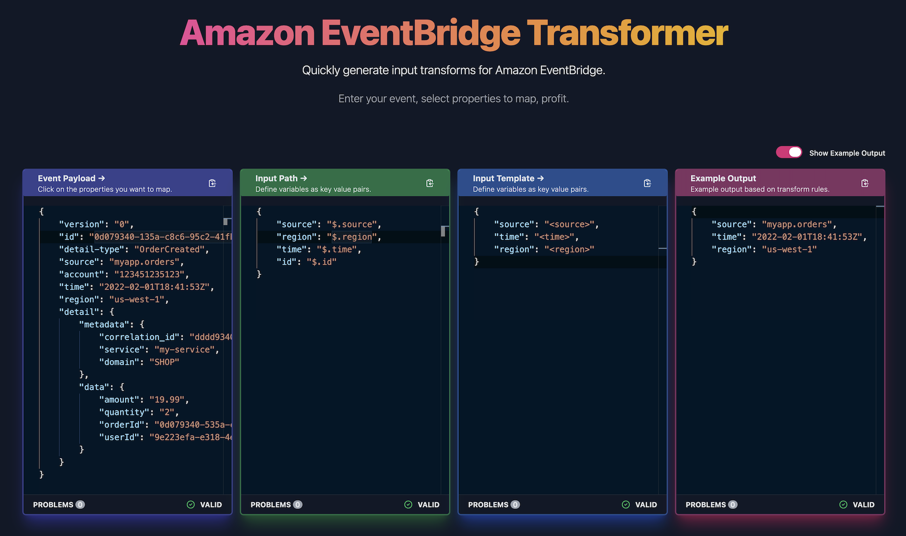

<h2>EventBridge Transformer 🤖</h2>

Quickly generate input transforms for Amazon EventBridge.</>

[![MIT License][license-badge]][license]
[![PRs Welcome][prs-badge]][prs]

[![Watch on GitHub][github-watch-badge]][github-watch]
[![Star on GitHub][github-star-badge]][github-star]

<h3>Features: Parse EventBridge events into Input Paths and Input Templates, show example output of transforms, custom editors to map code, validation and errors on the fly, and more...</h3>

[Read the Docs](https://eventbridge-transformer.vercel.app/#how-it-works)

# The problem

[The ability to transform your events before they reach your targets](https://docs.aws.amazon.com/eventbridge/latest/userguide/eb-transform-target-input.html) is a great feature from Amazon EventBridge.

Amazon EventBridge gives us a great serverless offering to create robust and resilient Event Driven Architectures and payload transformation can play a huge part in that process.

Why would you want to change your event payloads before they reach your targets?

- Remove PII data from Events (if consumers don't want)
- Tidy up data before it reaches target
- Easier integration with targets if events are in structured format
- And much more...

**Creating your Input Paths and Input Templates can be quite a manual process**, so I decided to experiment and create an online editor/tool that can help!

EventBridge Transformer allows you to quickly create Input Paths and Input Templates using your Event as the source!

# This solution

EventBridge Transformer uses custom editors to help you build your `Input Paths` and `Input Templates`.

You use your event as the source of the transformations and click on the properties you want to map. The editors will map these into `Input Paths` and `Input Templates`. You can then use these with Amazon EventBridge to transform your event payloads before they reach your targets.

_This project is experimental any problems are issues feel free to raise GitHub issues or just reach out.._

# Getting Started

1. Visit [https://eventbridge-transformer.vercel.app/](https://eventbridge-transformer.vercel.app/).

2. Paste your EventBridge event into the "Event Payload" editor.

3. Click on the properties within your event to generate your EventBridge input path. Then click on fields in the input path to generate your input template.

4. Once you are happy with your input paths and templates you can quickly copy the format to clipboard using the editor icons.

# Contributing

If you have any questions, features or issues please raise any issue or pull requests you like. I will try my best to get back to you.

[license-badge]: https://img.shields.io/github/license/boyney123/eventbridge-transformer.svg?color=yellow
[license]: https://github.com/boyney123/eventbridge-transformer/blob/main/LICENCE
[prs-badge]: https://img.shields.io/badge/PRs-welcome-brightgreen.svg?style=flat-square
[prs]: http://makeapullrequest.com
[github-watch-badge]: https://img.shields.io/github/watchers/boyney123/eventbridge-transformer.svg?style=social
[github-watch]: https://github.com/boyney123/eventbridge-transformer/watchers
[github-star-badge]: https://img.shields.io/github/stars/boyney123/eventbridge-transformer.svg?style=social
[github-star]: https://github.com/boyney123/eventbridge-transformer/stargazers

# License

MIT.
